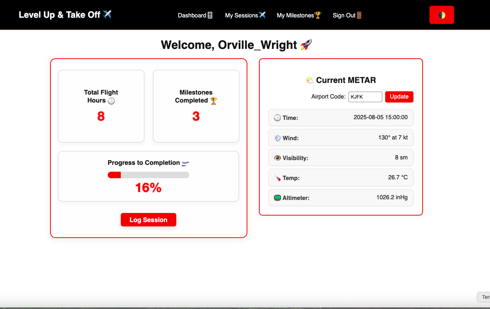

# ✈️ Flight Path Journal

Flight Path Journal is a full-stack web application designed to help student pilots track their progress toward certification. Log your flight sessions, monitor milestones, and visualize your path to becoming a licensed pilot.

---

## 📸 App Screenshot

 <!-- Replace with the actual image path -->

---

## 🚀 Getting Started

This application was built so that aspiring pilots can:
- Log flight sessions with key details like date, duration, aircraft, and notes.
- Track certification milestones (e.g., First Solo, Night Flights, Cross-Country).
- Visualize overall progress with completion bars and milestone summaries.
- Use a clean and intuitive dashboard tailored for students and instructors.

---

## 🔗 Live Link

[🌐 View Live App](https://flight-path-journal-06b5e8eeaa6c.herokuapp.com/) <!-- Replace with actual URL -->

---

## 📘 Project Planning

- [🧠 Trello Board](https://trello.com/b/rXgpKNAp/flight-path-journal)
- [🎨 Wireframes & Mockups](https://viewer.diagrams.net/?tags=%7B%7D&lightbox=1&highlight=0000ff&edit=_blank&layers=1&nav=1&title=Flight%20Path&dark=auto#R%3Cmxfile%3E%3Cdiagram%20name%3D%22Page-1%22%20id%3D%22n_VclW-vELvSy88i4euu%22%3E5Vzfc5s4EP5rPHm6DL9tP8Zx0mbucs3EnWnv6YYYxVYLyCdEbOevPxEkDF7FMW2MgOQhY62EQN8uq0%2B7EgP7Mtp8ov5qeUsCFA4sI9gM7OnAssa2wf9ngm0u8EZmLlhQHOSikmCGn5EQiusWKQ5QUmnICAkZXlWFcxLHaM4qMp9Ssq42eyRh9a4rf4GAYDb3Qyj9hgO2zKUj19jJPyO8WMo7m4aoiXzZWAiSpR%2BQdUlkXw3sS0oIy39Fm0sUZthJXPLrrl%2BpLR6Mopgdc8Hyz2l483A%2Fvvth3xg0ff6WTu0%2F3LyXJz9MxYDTBFHxwGwrUUjWOAr9mJcm8yUOg7%2F8LUmzuybMn%2F%2BUpQlFCVfgnXwkc09062dWYXApv4wyoWwrEyxZFIor4LjEUJ8QZWhTEolxfkIkQoxueRNR64lhCZuTNrjeKdAeCtmypLxCVb4wmkXR8w5X%2FkNAWwNmD8B8jRG3xAM414PooHLfxk0AZUGgTEsFlHEqoMwhQOpfDHHi42FVSPwQL2L%2Be84h4QZsT7JRY%2F4eX4iKCAdBdvlkvcQMzVb%2BPOtrzZ1WZqUkjQMUCOs8El7vHeD1FOjaJwN3BMCN%2FQj1BF1XN7pjgC6KfBz2BN6RZnjly1OCd%2BUnyZrQzrsHWVudtUxTN%2BImQDxBSYJJnPQUcUc34hZAPMIhShiJUV8xH2rGHBKOr9sVnBN1MTNZK93fAaZmN8rUHBsA9%2BXhB1%2BC3bTUHw%2BPxrwldM1xAMIzRnG86Am%2BugmbAxe%2FvcJXN2Nz4Kq3V%2FhqJ2gOnLsG7uQxzG49y5nabL7ki5CBO%2B065qLWbhljc%2BCSmqugIG19g99qGXmD6H9ZMeUCRTN%2FKya71kTaHBiuGAz5%2BA2K%2FksxzUzpgpcY5bX8yYYtNeFRXU1ULVjBQcZugwYs7%2F%2BxtaBgKs1qAUY6PqAWVHymUTVAj6TiMgc8eydyU%2BPqTKCwfVs1hxYZ0fcPXEMf1ER2anw0cjXnTHN8KqQsGPNobXaq0Gpn4h0WjHcEPmtpeqo%2BvLrDHRYMdwQp9TO63BeIdUc8LBjxeCTzNLmgCM5bHcVYe9TDglGPmLC25kd%2BAWDdMQ0TsuEGUiLH04EaKZFm6YGtCEe0OiViHs9eW8IRbLhGmLaXI9SGVzdHkK6nBO%2FfafSg2BHYUYB1MwQH%2BtY250TqA6ydHjhW3xHWzg8gws1E3WtTBMtpG0VwIXZdjDQWJlCDrZ23LPIOYzkfVBPao%2B8w7vNBNaE9Am%2FCl2I%2Fl33AxXci%2FD6qTgm2IoXtKHfSeScDHdp%2FE%2FH3QtfvfzzEORVUFlxhtzcA77wDvs1G1uDimqkCPx2FV%2FfiWnZcDsCjZE7xqsUx%2BONRlrVvpjebBR0uuFucVKpt09qX2zZc0PC5iaVtDcfXR1j3ctuDFlzZFtF5oNWOQ%2FveQhPmSxtIg9RgZb97NORkLM3u2tEQ8z1OSjfrdrt1NqQ%2BwNrJWrcOh9QHWDsxg3slWpzJqw2vfmIGt0n0y4D1EzNIffs2zeknYdBLNJNrqs%2FDjjniMWqUh7lwDutkYL3%2BGfOqJrSnmqAR53pAcRrlOhi4k7M7FAfcP58NLH4b4%2BySRKsQ8RkxOz3WY%2B2o%2FLip%2BjzT6Ry5MgFF0WOum7Pr8nL7rF%2FK2Fs8qhy%2BcvV4OmUonNY%2B1ihYoJkockAw296j8GUn89WuZvJIYjkJmFZVNfxNu8g%2BDseLV%2FckRl%2FJrR9vAeq8mezAO5R%2Byp7nINhlNA0FmoWQvozjCVW6V2Es7nFHMH%2BWQpvO3oaHIjYgu0hISudIXLXTFOhoaOx1JNdDsiM%2Bwy4QAx29qLwY%2BG9YgeJoc0usgN%2BKbr8XdbzwT1Y4d2VxuilXTrevvsLye4YvUB4AQ2a9%2BmdmnlftyPaaNTPp7Zozs2dESWFnvOYah7LdC2t9pWXVIsv8Vthk1UQ3mBUWyn%2BXDJSXdvaZFd40z1yXR0yfb9qx3TY7Hu1tBnCH4%2FNx6W%2F0a1Y92nee%2Bwz%2FFavmuve3pWarrEHy%2BuOb7t5ZQlfMyru3JO%2FyyHeGF3efI82b777pal%2F9Dw%3D%3D%3C%2Fdiagram%3E%3C%2Fmxfile%3E)

---

## 💻 Technologies Used

- **Frontend:** HTML5, CSS3, EJS (Embedded JavaScript Templates)
- **Backend:** Node.js, Express.js
- **Database:** MongoDB + Mongoose ODM
- **Authentication:** bcrypt, express-session
- **Other Tools:** dotenv, morgan, method-override

---

## 📚 References

These resources were consulted and used as references during development:

- [Mozilla Developer Network (MDN)](https://developer.mozilla.org/)
- [W3Schools](https://www.w3schools.com/)
- [Stack Overflow](https://stackoverflow.com/)
- [EJS Documentation](https://ejs.co/)
- [MongoDB Mongoose Docs](https://mongoosejs.com/)
- [Bootstrap Icons](https://icons.getbootstrap.com/) (if used)
- [Flight Training Milestone Guidelines (FAA)](https://www.faa.gov/)
- [GeeksforGeeks JavaScript & Express Articles](https://www.geeksforgeeks.org/)
- [ChatGPT by OpenAI](https://chat.openai.com/) — code debugging and guidance

---

## 🧩 Features

- 🛫 Add, edit, and delete flight sessions
- ✅ Track milestone progress and completions
- 📊 View progress toward certification with visual indicators
- 🔐 User authentication for secure access
- 📥 Future feature: PDF downloads of logged sessions

---
## 🌤 METAR Weather Data
This app fetches real-time METAR (Meteorological Aerodrome Report) data directly from the National Weather Service Aviation Weather Center (AWC), an official government source.

We use their Text Data Server (TDS) endpoint to retrieve METAR data based on ICAO airport codes.

🔗 API Endpoint Used:

[Aviation Weather](https://aviationweather.gov/cgi-bin/data/metar.php?ids=KJFK&format=raw&hours=0&taf=off&layout=on)
ids= specifies the ICAO code (e.g. KJFK)

format=raw returns the unparsed METAR string

hours=0 fetches the latest report

taf=off disables TAF (Terminal Aerodrome Forecast) data

layout=on provides plain text formatting

📦 Data includes:
Raw METAR string (e.g., KJFK 051951Z 18012KT 10SM FEW050 BKN250 30/16 A2992)

Wind speed and direction

Visibility

Cloud layers

Temperature and dew point

Altimeter settings

Flight category inference (e.g., VFR, IFR)

⚠️ Note: This is a public, no-authentication API provided by NOAA and NWS, and is suitable for non-commercial educational use.
---

## 🎯 Next Steps

- [ ] Connect to a METAR weather API for flight condition logs
- [ ] Add PDF export functionality
- [ ] Add session-type filters and sort options
- [ ] Send email reminders for key milestones

---

## 👨‍🏫 Author

**Orville Davis**  
[GitHub](https://github.com/mrodavis) • [LinkedIn](https://linkedin.com/in/orville-xavier-davis) • [Email](mailto:orville@scrapit.io)

---

## 📜 License

MIT License. Feel free to fork, contribute, and build upon this project.
